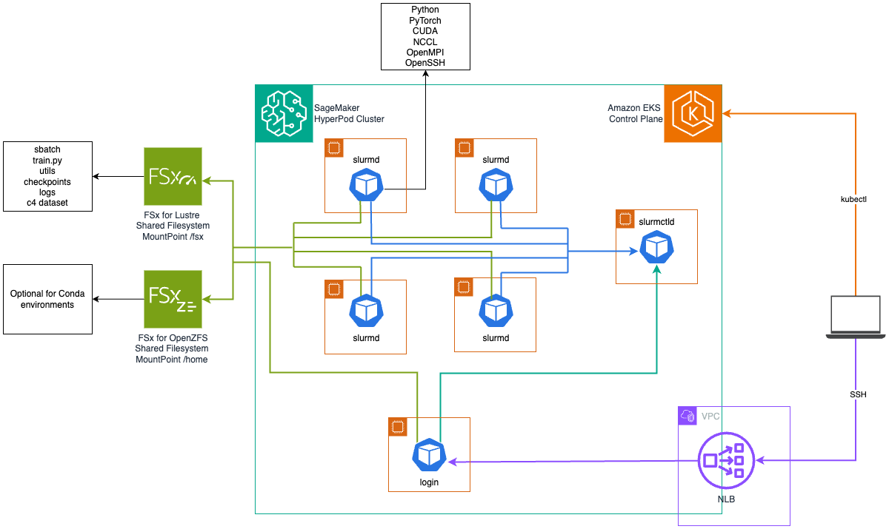

# Running Slurm on HyperPod EKS with Slinky

### What is the Slinky Project?

The [Slinky Project](https://github.com/SlinkyProject/slurm-operator/tree/main) is an
open-source solution maintained by SchedMD (the main developers of Slurm) that deploys Slurm
on Kubernetes. When paired with HyperPod EKS, the Slinky Project unlocks the ability for
enterprises who have standardized infrastructure management on Kubernetes to deliver a
Slurm-based experience to their ML scientists. It also enables training, experimentation,
and inference to happen on the same cluster of accelerated nodes with the built-in resiliency
provided by HyperPod.

---

### Slinky on HyperPod EKS Architecture


The diagram above depicts the resulting proof-of-concept deployment outlined in this guide.
An Amazon EKS cluster acts as an orchestration layer, while a HyperPod cluster delivers a
resilient instance group of GPU accelerated compute nodes. The Slinky Slurm operator is
installed to extend Kubernetes with custom resources and actions, and a containerized Slurm
cluster is deployed using Kubernetes pods via Helm chart. This Slurm cluster includes the
following components:
| Component | Description |
|-----------|-------------|
| Controller (slurmctld) | The central management daemon that monitors resources, accepts jobs, and assigns work to compute nodes. |
| Accounting (slurmdbd) | Handles job accounting and user/project management through a MariaDB database backend. |
| Compute (slurmd) | The worker nodes that execute jobs, organized into NodeSets which can be grouped into different partitions. |
| Login | Provides SSH access points for users to interact with the Slurm cluster and submit jobs. |
| REST API (slurmrestd) | Offers HTTP-based API access to Slurm functionality for programmatic interaction with the cluster. |
| Authentication (sackd) | Manages credential authentication for secure access to Slurm services. |
| MariaDB | The database backend used by the accounting service to store job, user, and project information. |
| Slurm Exporter | Collects and exports Slurm metrics for monitoring purposes. |

The login LoadBalancer type service is annotated to dynamically create an AWS Network Load
Balancer using the
[AWS Load Balancer Controller](https://github.com/kubernetes-sigs/aws-load-balancer-controller),
allowing ML scientists to SSH into their login pods without interfacing with the Kubernetes
API server via kubectl.

The login and compute node pods also have FSx for Lustre and (optionally) FSx for OpenZFS
shared filesystems mounted. Having containerized compute node pods allows many dependencies
that would traditionally be installed manually using Conda or a Python virtual environment to
be baked into the container image, but shared filesystems are still beneficial for storing
training artifacts, data, logs, and checkpoints. If Conda environments are still required,
FSx for OpenZFS has proven optimal to avoid IOPS saturation with many small files.

---

### Release Notes

The following was tested in two infrastructure scenarios for hosting the compute NodeSet pods:
1. On 4 `ml.g5.8xlarge` instances (1 A10G Tensor Core GPU each)
2. On 2 `ml.p5.48xlarge` instances (8 H100 Tensor Core GPUs each) with EFAv2

For simplicity, 2 `ml.m5.4xlarge` instances were also allocated for separately hosting other
components like the Controller and Login pods. You can adjust the number and type of instances
associated with your HyperPod cluster, as well as the component affinity rules in
`slurm-values.yaml.template` to modify how they are spread across your nodes.

Testing used
[Slurm Operator v1.0.1](https://github.com/orgs/slinkyproject/packages/container/package/charts/slurm-operator)
and
[Slurm Cluster v1.0.1](https://github.com/orgs/slinkyproject/packages/container/package/charts/slurm)
Helm charts pulled as OCI artifacts from the Slinky container registry.

Worker pods were built with Python 3.12.8 + PyTorch 2.6.0 + CUDA 12.6 + NCCL 2.23.4 +
EFA Installer 1.38.0 (bundled with OFI NCCL plugin) pre-installed in the container image.
See the [Docker Build for the Slurmd Deep Learning Container](./Docker-Build-README.md)
for details.

* * *

### Quick Start (Automated Deployment)

The automated deployment uses three scripts that handle the entire lifecycle:

```
deploy.sh   →   install.sh   →   (run workloads)   →   destroy.sh
```

#### <u>Prerequisites</u>

- AWS CLI configured with appropriate permissions
- `jq` (for CloudFormation) or `terraform` (for Terraform)
- `kubectl`, `helm`
- Docker (only if using `--local-build` for container images)

#### <u>Clone the Repository</u>
```
git clone https://github.com/awslabs/awsome-distributed-training.git
cp -r awsome-distributed-training/1.architectures/7.sagemaker-hyperpod-eks/slinky-slurm .
cd slinky-slurm
```

#### <u>Step 1: Deploy Infrastructure</u>

`deploy.sh` deploys the HyperPod EKS cluster via CloudFormation or Terraform, resolves
availability zones, substitutes parameters, and extracts stack outputs to `env_vars.sh`.

Deploy with 4 `ml.g5.8xlarge` instances using CloudFormation:
```
./deploy.sh --instance-type ml.g5.8xlarge --infra cfn
```
Deploy with 2 `ml.p5.48xlarge` instances using CloudFormation:
```
./deploy.sh --instance-type ml.p5.48xlarge --instance-count 2 --infra cfn
```
Deploy using Terraform:
```
./deploy.sh --instance-type ml.g5.8xlarge --infra tf
```
Override the default region and availability zone:
```
./deploy.sh --instance-type ml.g5.8xlarge --infra cfn --region us-east-1 --az-id use1-az2
```

After the script completes, source the environment variables:
```
source env_vars.sh
```

Run `./deploy.sh --help` for all available options.

Checkout the AI on SageMaker HyperPod Lab for more information on deploying the
[HyperPod EKS CloudFormation Stack](https://awslabs.github.io/ai-on-sagemaker-hyperpod/docs/common/infrastructure-as-a-code/amazon-cloudFormation)
or the
[HyperPod EKS Terraform Modules](https://awslabs.github.io/ai-on-sagemaker-hyperpod/docs/common/infrastructure-as-a-code/terraform).

#### <u>Step 2: Build Image, Install Slurm</u>

`install.sh` orchestrates `setup.sh` (container image build via CodeBuild, SSH key
generation, Helm values template substitution) followed by cert-manager, the AWS Load
Balancer Controller (with Pod Identity), public subnet tagging, FSx Lustre PV/PVC,
MariaDB, Slurm operator, and Slurm cluster Helm installations and NLB configuration.

Install with CodeBuild image build (default):
```
./install.sh --instance-type ml.g5.8xlarge --infra cfn
```
Install with local Docker build instead of CodeBuild:
```
./install.sh --instance-type ml.g5.8xlarge --infra cfn --local-build
```
Install with an existing ECR image (skip build entirely):
```
./install.sh --instance-type ml.g5.8xlarge --infra cfn --skip-build
```
Re-install Slurm without rebuilding the image or regenerating values:
```
./install.sh --skip-setup
```

Run `./install.sh --help` for all available options.

#### <u>Step 3: Verify the Deployment</u>

Update your kubectl context and verify:
```
aws eks update-kubeconfig --name $EKS_CLUSTER_NAME

kubectl get nodes

kubectl -n slurm get pods -l app.kubernetes.io/instance=slurm
```

Verify cert-manager and the AWS Load Balancer Controller are running:
```
kubectl get pods -n cert-manager
kubectl get pods -n kube-system -l app.kubernetes.io/name=aws-load-balancer-controller
```

> **NOTE:** The EBS CSI driver and a `gp3` StorageClass are prerequisites
> for persistent volume claims used by MariaDB and Slurm components. If the
> EBS CSI addon is not installed on your HyperPod cluster, see the
> [EBS CSI driver documentation](https://docs.aws.amazon.com/sagemaker/latest/dg/sagemaker-hyperpod-eks-ebs.html)
> for installation instructions. The HyperPod EBS CSI driver role requires an
> inline IAM policy with `sagemaker:AttachClusterNodeVolume`,
> `sagemaker:DetachClusterNodeVolume`, `eks:DescribeCluster`, and standard
> EC2 volume actions.

#### <u>Clean Up</u>

`destroy.sh` tears down all resources in reverse order (Slurm cluster, operator,
MariaDB, FSx PVC, AWS Load Balancer Controller with Pod Identity + IAM, cert-manager,
CodeBuild stack, HyperPod infrastructure):

```
./destroy.sh --infra cfn
```

Run `./destroy.sh --help` for all available options.

* * *

### Basic Tests:

SSH into the login node as root from the NLB endpoint:

```
SLURM_LOGIN_HOSTNAME="$(kubectl get services -n slurm -l app.kubernetes.io/instance=slurm,app.kubernetes.io/name=login -o jsonpath="{.items[0].status.loadBalancer.ingress[0].hostname}")"

ssh -i ~/.ssh/id_ed25519_slurm -p 22 root@$SLURM_LOGIN_HOSTNAME
```
---

Check the available nodes:

```
sinfo

PARTITION AVAIL  TIMELIMIT  NODES  STATE NODELIST
slinky       up   infinite      4   idle slinky-[0-3]
all*         up   infinite      4   idle slinky-[0-3]
```
Note that in both scenarios (using 4 `ml.g5.8xlarge` instances or 2 `ml.p5.48xlarge`
instances) we should see the same number of slurm compute nodes. When running on 4
`ml.g5.8xlarge` instances, each slurm compute node is mapped to 1 available A10G GPU,
whereas when running on 2 `ml.p5.48xlarge` instances, each slurm compute node is mapped
to 8 available H100 GPUs and 32 EFA network interfaces.

---

Verify FSx for Lustre filesystem mounts on the login pod:

```
df -h

# Filesystem                  Size  Used Avail Use% Mounted on
# overlay                     500G  5.7G  495G   2% /
# tmpfs                        64M     0   64M   0% /dev
# 10.2.179.105@tcp:/vm4lxb4v  1.2T  7.5M  1.2T   1% /fsx
# tmpfs                        59G  4.0K   59G   1% /etc/slurm
# ...

exit
```
---

Verify FSx for Lustre filesystem mounts on the compute node pods:

```
kubectl -n slurm exec -it pod/slurm-worker-slinky-0 -- bash --login

df -h

# Filesystem                  Size  Used Avail Use% Mounted on
# overlay                     500G   31G  470G   7% /
# tmpfs                        64M     0   64M   0% /dev
# 10.2.179.105@tcp:/vm4lxb4v  1.2T  7.5M  1.2T   1% /fsx
# tmpfs                        59G  4.0K   59G   1% /etc/slurm
# ...
```
---

Check the installed CUDA compiler version on compute node pods:

```
nvcc --version

# nvcc: NVIDIA (R) Cuda compiler driver
# Copyright (c) 2005-2024 NVIDIA Corporation
# Built on Tue_Oct_29_23:50:19_PDT_2024
# Cuda compilation tools, release 12.6, V12.6.85
# Build cuda_12.6.r12.6/compiler.35059454_0
```
---

Check the NCCL version on compute node pods:

```
ldconfig -v | grep "libnccl.so" | tail -n1 | sed -r 's/^.*\.so\.//'

# 2.23.4
```
---

Confirm NCCL headers are installed worker node pods:

```
find /usr/local/lib/ -name "nccl.h" 2>/dev/null

# /usr/local/lib/python3.12/site-packages/torch/include/torch/csrc/cuda/nccl.h
```
---

Check EFA availability:
```
ls /sys/class/infiniband/
fi_info -p efa
```
Check that the EFA libraries are properly mounted
```
ls /opt/amazon/efa/lib
ls /opt/amazon/ofi-nccl/lib/x86_64-linux-gnu
```
Verify EFA device allocation:
```
ls -l /dev/infiniband/
```
Verify intra-node GPU topology:
```
nvidia-smi topo -m
```
For `ml.p5.48xlarge` instances, the GPU topology should show all GPUs are connected via
NVLink (NV18 indicates 18 NVLink connections). The GPUs are split across two NUMA nodes
(0-3 on NUMA 0, 4-7 on NUMA 1).

---

### FSDP Test

> **NOTE:** The `g5-llama2_7b-training.sbatch` script has been validated on
> `ml.g5.8xlarge` instances. The `p5-llama2_7b-training.sbatch` script is
> provided for `ml.p5.48xlarge` instances but has not yet been validated.

SSH into the login pod as root, clone the repo, and create a checkpoints directory:

```
SLURM_LOGIN_HOSTNAME="$(kubectl get services -n slurm -l app.kubernetes.io/instance=slurm,app.kubernetes.io/name=login -o jsonpath="{.items[0].status.loadBalancer.ingress[0].hostname}")"

ssh -i ~/.ssh/id_ed25519_slurm -p 22 root@$SLURM_LOGIN_HOSTNAME

# install git
apt update
apt install -y git
git --version

# install vim (optional)
apt install -y vim
vim --version

cd /fsx
git clone https://github.com/awslabs/awsome-distributed-training/
cd awsome-distributed-training/3.test_cases/pytorch/FSDP/slurm

mkdir -p checkpoints
```
---
Copy the modified sbatch file:
```
export SLINKY_PATH=/fsx/awsome-distributed-training/1.architectures/7.sagemaker-hyperpod-eks/slinky-slurm

# for g5 instances
cp ${SLINKY_PATH}/sbatch/fsdp/g5-llama2_7b-training.sbatch ./llama2_7b-training.sbatch

# for p5 instances
cp ${SLINKY_PATH}/sbatch/fsdp/p5-llama2_7b-training.sbatch ./llama2_7b-training.sbatch
```
---
Add your Hugging Face token to stream the
[allenai/c4](https://huggingface.co/datasets/allenai/c4) dataset without throttling:
```
NEW_TOKEN="your_new_token_here"
sed -i "s/export HF_TOKEN=.*$/export HF_TOKEN=\"$NEW_TOKEN\"/" llama2_7b-training.sbatch
```

---
Kick-off the training job:
```
sbatch llama2_7b-training.sbatch
```
---

Watch the output logs from the login pod:

```
export JOB_ID=$(squeue -h -u root -o "%i" | head -1)

tail -f logs/llama2_7b-FSDP_${JOB_ID}.out
```
---

Watch the error logs from `slurm-worker-slinky-0`:

```
# from a new terminal window
kubectl -n slurm exec -it pod/slurm-worker-slinky-0 -- bash --login

cd /fsx/awsome-distributed-training/3.test_cases/pytorch/FSDP/slurm
export JOB_ID=$(squeue -h -u root -o "%i" | head -1)

watch "grep 'Batch.*Loss' logs/llama2_7b-FSDP_${JOB_ID}.err"

# or

tail -f logs/llama2_7b-FSDP_${JOB_ID}.err | grep --line-buffered 'Batch.*Loss'
```

Watch squeue from `slurm-worker-slinky-1`:

```
# from a new terminal window
kubectl -n slurm exec -it pod/slurm-worker-slinky-1 -- bash --login

# 1 second updates
watch -n 1 squeue
```

Watch checkpoints from `slurm-worker-slinky-2`:

```
# from a new terminal window
kubectl -n slurm exec -it pod/slurm-worker-slinky-2 -- bash --login

cd /fsx/awsome-distributed-training/3.test_cases/pytorch/FSDP/slurm

# highlight changes, show timestamps, 5 second updates
watch -n 5 -d "ls -lh checkpoints"
```

* * *

### Development & Testing:

The deployment scripts and their helper library `lib/deploy_helpers.sh` are
tested using [bats-core](https://github.com/bats-core/bats-core). The test
suite covers argument parsing, instance type validation, Helm profile
resolution via EC2 API, AZ validation, CloudFormation parameter substitution
(jq), Terraform variable overrides (sed/awk), template variable substitution,
install.sh phases and flag validation, and destroy.sh teardown ordering.

```
# One-time setup: install bats-core
brew install bats-core            # macOS
sudo apt-get install -y bats      # Debian/Ubuntu
npm install -g bats               # cross-platform

# One-time setup: install bats helper libraries
bash tests/install_bats_libs.sh

# Run all tests (108 tests across 4 test files)
bats tests/

# Run a specific test file
bats tests/test_deploy.bats
```
